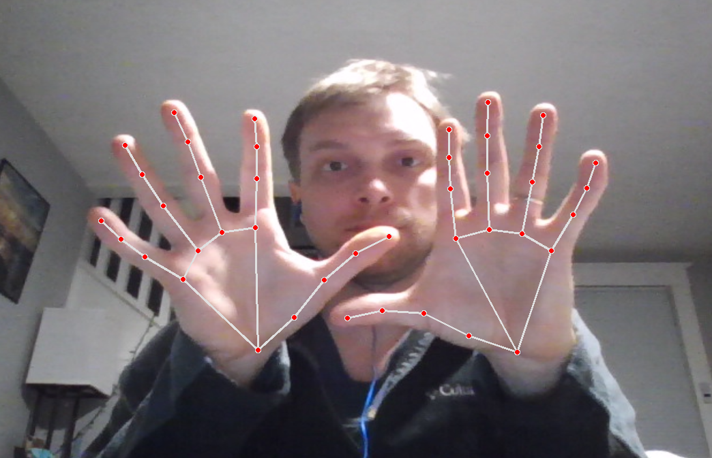

<div align="center">
  
</div>

<!--  -->

# Hand Landmark Tracker &nbsp;[](https://www.python.org/downloads/)
Hand Landmark Tracker bring a new perspective to human-computer interaction using hands. The hand is the most versatile and intuitive controller someone can use, so it makes sense to see if there is a way to design an interface that takes advantage of the hands without requiring them to touch anything.
This code uses the amazing features of Google's machine learning suite [MediaPipe](https://developers.google.com/mediapipe), a media-based ML package for classification and recognition with neural networks.

<!-- This program uses openCV and mediapipe to acquire hand landmarks and post/gesture tracking commands to stream to a [Robot Web Server]().  -->

<!-- <figure> -->
<!--  <br> -->
<!--  <figcaption>Landmark tracking. Multi-hand classification and landmark identification.</figcaption> -->
<!-- </figure> -->

## Installation

1. Create a virtual environment using [Anaconda](https://www.anaconda.com/products/distribution) or Python's virtualenv.
   - Using Anaconda:
      ~~~
      conda create -n hand-tracker python=3.8
      conda activate hand-tracker
      ~~~
   - Using Python's virtualenv:
     ~~~
     python3 -m venv hand-tracker
     source hand-tracker/bin/activate # Linux
     call hand-tracker/Scripts/activate # Windows
     ~~~
2. Clone the repository and navigate to the project directory.
   ~~~
   git clone https://github.com/Jshulgach/Hand-Landmark-Tracker.git
   cd Hand-Landmark-Tracker
   ~~~
3. Install the required packages.
    ~~~
    pip install -r requirements.txt
    ~~~


## Getting Started

### Hand tracker Class
The HandTracker class can be easily imported and used in your own projects by creating an instance of the class and calling the `track` method.
```python
from tracking import HandTracker
tracker = HandTracker(visualize=True) # Enable visualization on a CV frame
tracker.run()
```
This will start hand tracking and displaying any landmarks captured on top of detected hands.

<!--  -->
<div align="center">
  
</div>

### MiniArm Gripper Virtual Spacemouse Control

A more interesting demo is using hand tracking like a virtual spacemouse as a position displacement controller operating the position of a robot end effector. We can use the [MiniArm](https://github.com/Jshulgach/Mini-Arm) robot for example and send position and gripper commands to the robot server.

To run the spacemouse demo, the `main.py` script can be run with the `spacemouse` mode and COM port set. Enabling the verbose mode allows for text output of the tracking data.
~~~
python main.py --mode spacemouse --port COM5 --verbose true
~~~

<!--  -->
<!--  -->
<div align="right">
  
</div>
<div align="left">
  
</div>


## Acknowledgement

The project was inspired by xenon-19's [Gesture Controlled Virtual Mouse](https://github.com/xenon-19/Gesture-Controlled-Virtual-Mouse) project.
 Thanks Google for the amazing [MediaPipe](https://developers.google.com/mediapipe) library.


