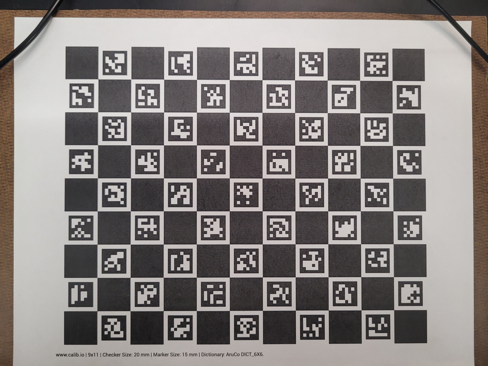

<div align="center">
  
</div>

<!--  -->

# Hand Landmark Tracker &nbsp;[](https://www.python.org/downloads/)
Hand Landmark Tracker bring a new perspective to human-computer interaction using hands. The hand is the most versatile and intuitive controller someone can use, so it makes sense to see if there is a way to design an interface that takes advantage of the hands without requiring them to touch anything.
This code uses the amazing features of Google's machine learning suite [MediaPipe](https://developers.google.com/mediapipe), a media-based ML package for classification and recognition with neural networks.

<!-- This program uses openCV and mediapipe to acquire hand landmarks and post/gesture tracking commands to stream to a [Robot Web Server]().  -->

<!-- <figure> -->
<!--  <br> -->
<!--  <figcaption>Landmark tracking. Multi-hand classification and landmark identification.</figcaption> -->
<!-- </figure> -->

## Installation

1. Create a virtual environment using [Anaconda](https://www.anaconda.com/products/distribution) or Python's virtualenv.
   - Using Anaconda:
      ~~~
      conda create -n hand-tracker python=3.10
      conda activate hand-tracker
      ~~~
   - Using Python's virtualenv:
     ~~~
     python3 -m venv hand-tracker
     source hand-tracker/bin/activate # Linux/macOS
     call hand-tracker/Scripts/activate # Windows
     ~~~
2. Clone the repository and navigate to the project directory.
   ~~~
   git clone https://github.com/Jshulgach/Hand-Landmark-Tracker/unity_tree.git
   cd Hand-Landmark-Tracker
   ~~~
3. Install the required packages.
    ~~~
    pip install opencv-python
    pip install pyqt5
    pip install mediapipe==0.10.14 
    ~~~


## Getting Started

### Monocular Hand Tracking GUI
The easiest way to get started is with the interactive GUI applications:

```bash
# Hand tracking with GUI
python examples/01_basic_tracking/handtrack_gui.py

# Face tracking with GUI
python examples/01_basic_tracking/facetrack_gui.py

```
### Stereo Camera Hand Tracking GUI
#### Configuration
Edit `config.py` to set:

- `CAMERA_IDS`: List of camera indices (e.g., `[1, 2]`)
- `CHECKERBOARD_ROWS/COLS`: Inner corners of calibration board so (9x11 would be 8x10 - [n-1,m-1])
- `CHECKERBOARD_SQUARE_SIZE`: Square size in millimeters
- `UDP_PORT_LANDMARKS`: Port for 3D landmark data (default: 5005)
- `UDP_PORT_ANGLES`: Port for joint angle data (default: 5010)



**Figure:** Example of a checkerboard that could be used.

#### Calibration

##### Step 1: Test Cameras
```bash
python test_cameras.py
```
Verifies all cameras work at specified resolution. Press 'q' to quit, 's' to save test frames.

##### Step 2: Calibrate Cameras
```bash
python multi_camera_calibration.py
```
Requirements:
- Printed checkerboard pattern visible to all cameras
- 20+ image pairs from different positions and angles
- Press SPACE when all cameras show green borders
- Press 'q' after minimum 10 captures to finish early

Output: `calibration_data/multi_camera_calib_latest.npz`

##### Step 3: Verify Calibration
```bash
python verify_calibration.py
```
Shows reprojection errors, camera positions, and baseline distances. Good calibration: reprojection error under 0.5 pixels.

#### Running the Tracker
```bash
python stereo_handtrack_gui.py
```
##### GUI Controls

- Start Tracking: Begin multi-camera hand detection
- Enable Kalman Filter: Smooth 3D positions and angles
- Enable UDP Broadcasting: Stream data to external applications

##### Console Output
Real-time index finger angles printed on same line:
```
Frame 123 [3D Triangulated] - Index MCP: 12.34°, Index PIP: 45.67°, Index DIP: 23.89°
```
#### UDP Data Format

##### Landmarks (Port 5005)
```json
{
  "frame": 123,
  "num_hands": 1,
  "timestamp": 1234567890.123,
  "hands": [
    {
      "hand_index": 0,
      "landmarks": [[x1, y1, z1], [x2, y2, z2], ...]
    }
  ]
}
```

21 landmarks per hand in millimeters (world coordinates).

##### Joint Angles (Port 5010)
```json
{
  "frame": 123,
  "timestamp": 1234567890.123,
  "hands": [
    {
      "hand_index": 0,
      "angles": {
        "index_mcp": 12.34,
        "index_pip": 45.67,
        "index_dip": 23.89,
        "middle_mcp": 10.12,
        ...
      }
    }
  ]
}
```
14 angles per hand in degrees:
- Fingers: `{finger}_mcp`, `{finger}_pip`, `{finger}_dip` (index, middle, ring, pinky)
- Thumb: `thumb_cmc_mcp`, `thumb_ip`


**Features:**
- Real-time tracking from webcam or video file
- Kalman filter smoothing for stability
- Record landmarks to CSV/NPZ files
- **UDP broadcasting** for real-time streaming to other apps
- Dark theme UI with intuitive controls

### HandTracker Class
The HandTracker class can be easily imported and used in your own projects:
```python
from handtrack.tracker import HandTracker
tracker = HandTracker(visualize=True)  # Enable visualization
tracker.run()
```

## Acknowledgement

The project was inspired by xenon-19's [Gesture Controlled Virtual Mouse](https://github.com/xenon-19/Gesture-Controlled-Virtual-Mouse) project.
 Thanks Google for the amazing [MediaPipe](https://developers.google.com/mediapipe) library.


