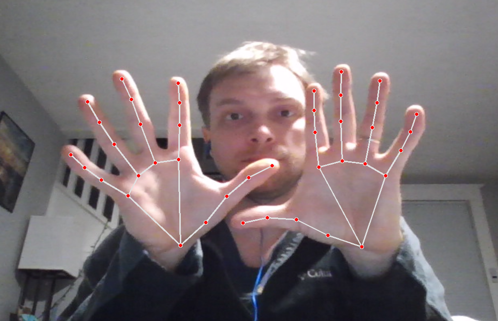

<div align="center">
  
</div>

<!--  -->

# Hand Landmark Tracker &nbsp;[](https://www.python.org/downloads/)
Hand Landmark Tracker bring a new perspective to human-computer interaction using hands. The hand is the most versatile and intuitive controller someone can use, so it makes sense to see if there is a way to design an interface that takes advantage of the hands without requiring them to touch anything.
This code uses the amazing features of Google's machine learning suite [MediaPipe](https://developers.google.com/mediapipe), a media-based ML package for classification and recognition with neural networks.

<!-- This program uses openCV and mediapipe to acquire hand landmarks and post/gesture tracking commands to stream to a [Robot Web Server]().  -->

<!-- <figure> -->
<!--  <br> -->
<!--  <figcaption>Landmark tracking. Multi-hand classification and landmark identification.</figcaption> -->
<!-- </figure> -->

## Installation

1. Create a virtual environment using [Anaconda](https://www.anaconda.com/products/distribution) or Python's virtualenv.
   - Using Anaconda:
      ~~~
      conda create -n hand-tracker python=3.10
      conda activate hand-tracker
      ~~~
   - Using Python's virtualenv:
     ~~~
     python3 -m venv hand-tracker
     source hand-tracker/bin/activate # Linux/macOS
     call hand-tracker/Scripts/activate # Windows
     ~~~
2. Clone the repository and navigate to the project directory.
   ~~~
   git clone https://github.com/Jshulgach/Hand-Landmark-Tracker.git
   cd Hand-Landmark-Tracker
   ~~~
3. Install the required packages.
    ~~~
  pip install -e .
    ~~~

Optional extras are available for feature-specific dependencies:
~~~
pip install -e .[stream]
pip install -e .[io,applications,ml]
~~~


## Getting Started

### Quick Start - Hand Tracking GUI
The easiest way to get started is with the interactive GUI applications:

```bash
# Hand tracking with GUI
python examples/01_basic_tracking/handtrack_gui.py

# Face tracking with GUI
python examples/01_basic_tracking/facetrack_gui.py
```

**Features:**
- Real-time tracking from webcam or video file
- Kalman filter smoothing for stability
- Record landmarks to CSV/NPZ files
- **UDP broadcasting** for real-time streaming to other apps
- Dark theme UI with intuitive controls

### Basic Hand Tracking
For a simpler command-line interface:
```bash
python examples/01_basic_tracking/handtrack_webcam.py
```

### HandTracker Class
The HandTracker class can be easily imported and used in your own projects:
```python
from handtrack.tracker import HandTracker
tracker = HandTracker(source=0, max_hands=1)
tracker.run()
```

### Explore Examples
For detailed examples and use cases, see the `examples/` directory:
- **01_basic_tracking/** - Real-time tracking with GUI
- **02_data_extraction/** - Save landmarks from videos
- **03_streaming/** - Stream data via LSL for integration with other tools
- **04_advanced_applications/** - Robot control and virtual hand rendering
- **Joint_Kinematics_from_EMG/** - Predict joint angles from EMG signals
- **Smoothing_Motion_with_RNN/** - Neural network motion smoothing

### MiniArm Gripper Virtual Spacemouse Control

A more interesting demo is using hand tracking like a virtual spacemouse as a position displacement controller operating the position of a robot end effector. We can use the [MiniArm](https://github.com/Jshulgach/Mini-Arm) robot for example and send position and gripper commands to the robot server.

To run the spacemouse demo, navigate to the advanced applications:
~~~
cd examples/04_advanced_applications/Miniarm
python miniarm.py --port COM5
~~~

---

## 🌐 UDP Broadcasting

Both hand and face tracking GUI applications support **real-time UDP broadcasting** for streaming landmark data to other applications:

### How to Use:

1. **Start tracker GUI:**
   ```bash
   python examples/01_basic_tracking/handtrack_gui.py
   ```

2. **In the GUI:**
   - Check "Enable UDP Broadcasting"
   - Set IP address (use `255.255.255.255` for local broadcast)
   - Set port (default: 5005)
   - Start tracking

3. **Receive Data (Python Example):**
   ```python
   import socket
   import json
   
   sock = socket.socket(socket.AF_INET, socket.SOCK_DGRAM)
   sock.bind(('', 5005))
   
   while True:
       data, addr = sock.recvfrom(65535)
       landmarks = json.loads(data.decode('utf-8'))
       print(f"Frame: {landmarks['frame']}, Hands: {landmarks['num_hands']}")
   ```

### Data Format (JSON):

**Hand Landmarks:**
```json
{
  "frame": 120,
  "num_hands": 2,
  "timestamp": 1705324800.123,
  "hands": [
    {
      "hand_index": 0,
      "landmarks": [[0.5, 0.3, 0.1], [0.51, 0.31, 0.09], ...]
    }
  ]
}
```

**Face Landmarks:**
```json
{
  "frame": 120,
  "num_faces": 1,
  "timestamp": 1705324800.123,
  "landmarks": [[0.5, 0.3, 0.1], [0.51, 0.31, 0.09], ...]
}
```

**Use Cases:**
- Real-time integration with game engines (Unity, Unreal)
- Gesture recognition systems
- Robot control
- Motion capture for animation
- Live performance capture

<!--  -->
<div align="center">
  
</div>


## Acknowledgement

The project was inspired by xenon-19's [Gesture Controlled Virtual Mouse](https://github.com/xenon-19/Gesture-Controlled-Virtual-Mouse) project.
 Thanks Google for the amazing [MediaPipe](https://developers.google.com/mediapipe) library.


