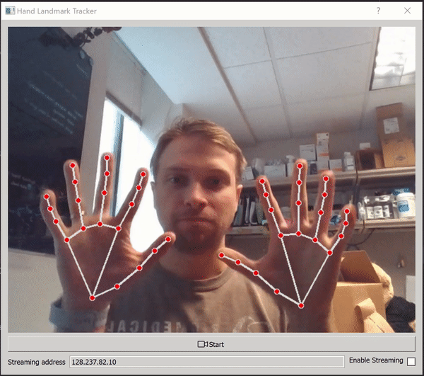
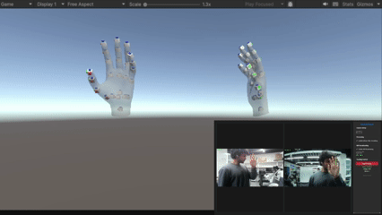

<div align="center">
  
</div>

<!--  -->

# Hand Landmark Tracker &nbsp;[](https://www.python.org/downloads/)
Hand Landmark Tracker is a Python toolkit for hand landmark tracking, multi-camera calibration, real-time visualization, and downstream streaming workflows. It wraps the core tracking library and the camera-facing applications behind a single CLI so that users do not need to know nested module paths.

The project is built around Google's [MediaPipe](https://developers.google.com/mediapipe) hand models, with additional support for multi-camera triangulation, joint-angle extraction, and UDP/LSL broadcasting.

## Quick Links

- Documentation: `https://jshulgach.github.io/Hand-Landmark-Tracker/`
- Package entrypoint: `handtracker`
- Release guide: `RELEASE.md`
- Changelog: `CHANGELOG.md`

<!-- This program uses openCV and mediapipe to acquire hand landmarks and post/gesture tracking commands to stream to a [Robot Web Server]().  -->

<!-- <figure> -->
<!--  <br> -->
<!--  <figcaption>Landmark tracking. Multi-hand classification and landmark identification.</figcaption> -->
<!-- </figure> -->

## Installation

1. Create a virtual environment using [Anaconda](https://www.anaconda.com/products/distribution) or Python's virtualenv.
   - Using Anaconda:
      ~~~
      conda create -n hand-tracker python=3.10
      conda activate hand-tracker
      ~~~
   - Using Python's virtualenv:
     ~~~
     python3 -m venv hand-tracker
     source hand-tracker/bin/activate # Linux/macOS
     call hand-tracker/Scripts/activate # Windows
     ~~~
2. Clone the repository and navigate to the project directory.
   ~~~
  git clone https://github.com/Jshulgach/Hand-Landmark-Tracker.git
   cd Hand-Landmark-Tracker
   ~~~
3. Install the package.

  Core install:
  ~~~
  pip install -e .
  ~~~

  For local development, docs, tests, and release tooling:
  ~~~
  pip install -e .[dev,docs,release]
  ~~~

  For OptiTrack workflows:
  ~~~
  pip install -e .[optitrack]
  ~~~


## Getting Started

### Main CLI

Run the installed application through the unified package entrypoint:

```bash
handtracker gui
```

The CLI auto-selects a camera backend. It prefers OptiTrack when the SDK is
available and otherwise falls back to the webcam backend. You can override that
selection when needed:

```bash
handtracker gui --backend webcam
handtracker calibrate
handtracker cameras
handtracker board
handtracker test-sender
handtracker doctor
handtracker inspect-calibration
```

Examples:

```bash
handtracker gui
handtracker gui --backend webcam
handtracker calibrate --backend optitrack
handtracker inspect-calibration --backend webcam
handtracker benchmark --backend webcam --frames 120
handtracker record --source 0 --frames 300 --save-video
handtracker replay recordings/session_20260512_120000
handtracker export recordings/session_20260512_120000
```

Related operational commands:

```bash
handtracker doctor
handtracker calibrate
handtracker cameras
handtracker board
handtracker test-sender
handtracker inspect-calibration
handtracker benchmark
handtracker record
handtracker replay <session-dir>
handtracker export <session-dir>
```

If you prefer explicit one-off entrypoints, the backend-specific commands remain available for backward compatibility.

Legacy explicit entrypoints still work for backend-specific workflows:

```bash
handtrack-doctor --optitrack
handtrack-optitrack-gui
handtrack-optitrack-calibrate
handtrack-optitrack-cameras
handtrack-optitrack-board
handtrack-optitrack-test-sender
```

### Production Architecture

- `handtrack`: reusable core APIs (tracking primitives, calibration, processing, IO/broadcast)
- `unity_hand_tracking.optitrack_cam_py`: flagship OptiTrack application layer and camera backend integration
- `examples/`: scenario scripts, legacy demos, and utility tools

This separation keeps demo velocity high while preserving a stable API surface for downstream tools.

### Documentation and Public Site

The repository now targets a docs-first public surface:

- `README.md` for the quickstart and repository overview
- `docs/` for the full documentation site
- GitHub Pages deployment via MkDocs Material
- TestPyPI/PyPI publishing workflows for release distribution

### Legacy Mono/Stereo Demos

Legacy script-style demos were moved out of `src/` and are now located in:

```bash
examples/01_basic_tracking/unity_hand_tracking/mono/
examples/01_basic_tracking/unity_hand_tracking/stereo/
```

These are kept for reference and backward-compatible experimentation, while active development focuses on the OptiTrack package entrypoints.

#### UDP Data Format

##### Landmarks (Port 5005)
```json
{
  "frame": 123,
  "num_hands": 1,
  "timestamp": 1234567890.123,
  "hands": [
    {
      "hand_index": 0,
      "landmarks": [[x1, y1, z1], [x2, y2, z2], ...]
    }
  ]
}
```

21 landmarks per hand in millimeters (world coordinates).

##### Joint Angles (Port 5010)
```json
{
  "frame": 123,
  "timestamp": 1234567890.123,
  "hands": [
    {
      "hand_index": 0,
      "label": "Left",
      "angles": {
        "index_mcp": 12.34,
        "index_pip": 45.67,
        "index_dip": 23.89,
        "middle_mcp": 10.12,
        ...
      }
    }
  ]
}
```
14 angles per hand in degrees:
- Fingers: `{finger}_mcp`, `{finger}_pip`, `{finger}_dip` (index, middle, ring, pinky)
- Thumb: `thumb_cmc_mcp`, `thumb_ip`

`label` is optional but recommended for left/right routing. If it is omitted, downstream tools fall back to `hand_index` for compatibility with older senders.

When using `src/unity_hand_tracking/handtrack_data_handler.py`, the Unity listeners are expected on UDP ports `5015` (left hand) and `5017` (right hand).


**Features:**
- Real-time tracking from webcam or video file
- Kalman filter smoothing for stability
- Record landmarks, joint angles, and session metadata to CSV/NPZ files
- Replay recorded landmark sessions from a saved bundle
- Export recorded sessions into flat CSV artifacts for downstream tools
- Benchmark multi-camera backend timing and throughput from the CLI
- **UDP broadcasting** for real-time streaming to other apps
- Dark theme UI with intuitive controls



**Figure:** Example of a stereo hand tracking with unity. 

## Acknowledgement

The project was inspired by xenon-19's [Gesture Controlled Virtual Mouse](https://github.com/xenon-19/Gesture-Controlled-Virtual-Mouse) project.
 Thanks Google for the amazing [MediaPipe](https://developers.google.com/mediapipe) library.


