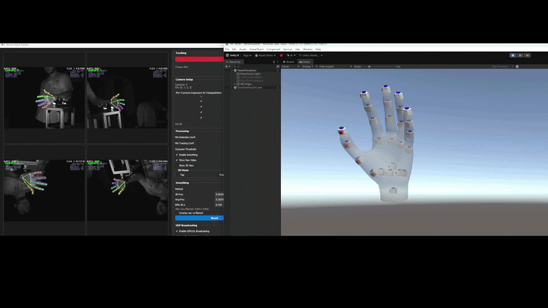

# HandTrack

HandTrack is a Python toolkit for hand landmark tracking, multi-camera calibration, joint-angle extraction, and real-time streaming.

It is aimed at two audiences:

- users who want a single terminal command such as `handtracker gui`
- developers who want reusable tracking and IO modules inside their own pipelines

## Quickstart

```bash
git clone https://github.com/Jshulgach/Hand-Landmark-Tracker.git
cd Hand-Landmark-Tracker
python -m venv .venv
.venv\Scripts\activate
python -m pip install -e .[dev,docs,release]
handtracker doctor
handtracker gui
```

## Main Commands

```bash
handtracker gui
handtracker calibrate
handtracker cameras
handtracker board
handtracker test-sender
handtracker doctor
handtracker inspect-calibration
handtracker benchmark
handtracker record
handtracker replay recordings/session_20260512_120000
handtracker export recordings/session_20260512_120000
```

The CLI auto-selects OptiTrack when its SDK is available and otherwise falls back to webcam.

## What It Covers

- live hand tracking via a unified CLI
- webcam and OptiTrack backend support
- calibration board generation and capture workflows
- session recording and backend performance benchmarking
- session replay from recorded landmark bundles
- session export to flat CSV for downstream analysis
- UDP and LSL broadcast utilities
- reusable Python modules for downstream analysis

## Visual Overview



## Public Release Goals

- installable package builds for TestPyPI and PyPI
- GitHub Pages-hosted documentation
- automated CI, docs build, and release workflows
- contributor and issue-reporting guidance for external users