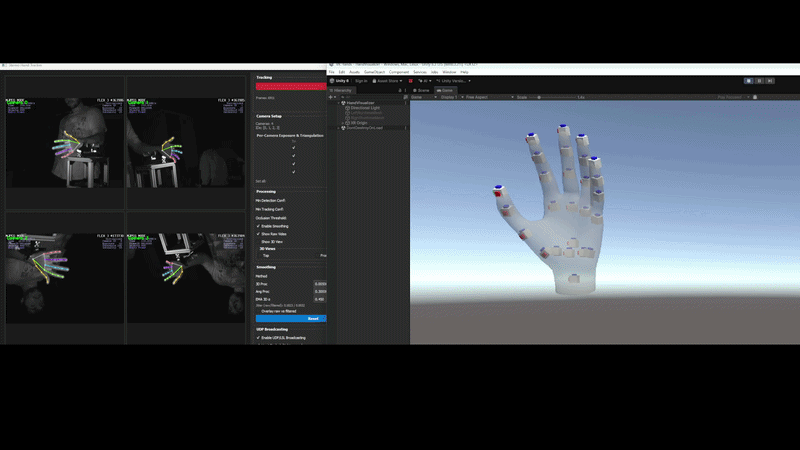

# MAVIS

**Motion Analysis and Visual Interaction Suite** turns webcam, video, or
caller-supplied frames into hand landmarks.

The first release is being prepared as `mavis-track`. Start with the
[installation guide](installation.md), then run `mavis-track demo` for
a desktop preview without calibration. The studio also provides face, pose,
and holistic preview modes.

For another application, use the [integration guide](integration.md):
`from mavis_track import HandTracker`, then `tracker.process(frame)`.
Your project keeps control of capture and display.

MAVIS includes numeric recordings, timed replay, rectangular CSV export,
optional UDP/LSL, and [advanced calibrated cameras](backends.md).
Image-normalized landmarks, hand-centered model estimates, and calibrated world
coordinates are distinct data products. Joint angles are geometric estimates.

See the [CLI](cli.md), [troubleshooting](troubleshooting.md), and
[release guide](releases.md) for further details.
